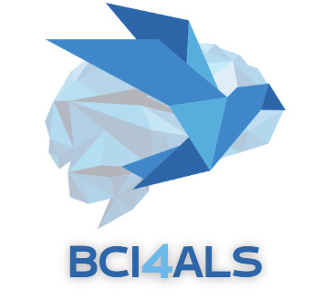
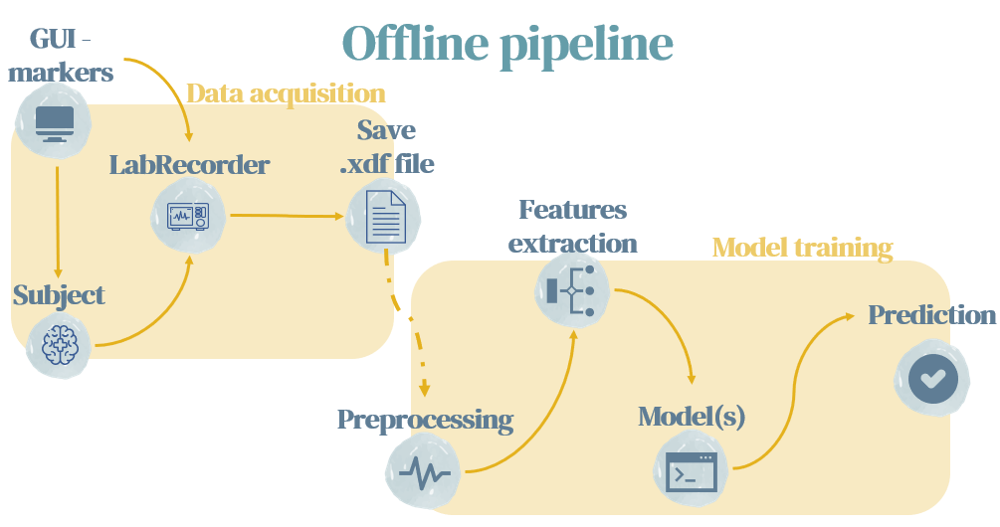

# BCI4ALS | 2022-2023 | TAU
**An EEG data classification based on P300 paradigm, built with python.**

## Table of contents
* [General info](#General-info)
* [Repo structure](#Repo-structure)
* [Setup](#Setups)
* [Notes](#notes)
* [Contacts](#Contacts)

## General info
This project was done as part of the BCI4ALS academic course
(for more information regarding the course, please check out: https://www.brainstormil.com/bci-4-als).   
The repository contains both online and offline pipelines that aim to predict the subject's intention regarding different stimuli.  
The end goal of this project is to allow the subject to control Smart-Home devices using BCI.

For a detailed explanation of the project, the various functions documentation, and applications, please see:
https://docs.google.com/document/d/1R05U__FPkcJwPW8BaAbBw7Ia1ys-FfBCWSafv4SjJFY/edit?usp=sharing

## Repo structure

├──BCI4ALS---Team - main project folder 
&emsp;&emsp;└── p300_light_on_off.py - the GUI for presenting P300 paradigm. 
&emsp;&emsp;└── offline_main.py - preprocessing offline recordings. 
&emsp;&emsp;└── EEGNET_classifier.py - offline model training. 
&emsp;&emsp;└── online_main.py - online full pipeline - from streaming to prediction. 
&emsp;&emsp;└── Old code - including different models implementations. 
&emsp;&emsp;&emsp;&emsp;└── features - relevant files for different ML models 
├──BCI_data - main data folder 
&emsp;&emsp;└── Recordings 
&emsp;&emsp;└── plots 
&emsp;&emsp;└── Segmented_data 
&emsp;&emsp;&emsp;&emsp;└── for_EEGNET 
&emsp;&emsp;&emsp;&emsp;&emsp;&emsp;└── {event name} 
&emsp;&emsp;&emsp;&emsp;&emsp;&emsp;&emsp;&emsp;└── {file name}.npy 

* Note that all necessary sub-folders will be created automatically, but it is best to ensure that your relevant recordings are saved in ../BCI_data/Recordings before running any preprocessing script.

## Setups
To run this project, first clone the repository:  
`git clone https://github.com/inbarblech/BCI4ALS---Team.git`  
Then install the requirements:   
`cd BCI4ALS---Team`  
`pip install -r requirements.txt`    
In addition, you need to install openBCI-GUI and LabRecorder (LSL).

## Notes
* All the data we used was collected using openBCI based EEG headset with 13 channels and standard 10-20 configuration.
* Current model (EEGNET) results:
  * All correct predictions: 43, Total test: 90, Total accuracy: 48% ​
  * Target correct predictions: 15, Targets in test: 28, Target accuracy: 54% ​
  * Other correct predictions: 4, Other in test: 31, Other accuracy: 13% ​
  * Gap filler correct predictions: 24, Gap filler in test: 31, Gap filler accuracy: 77% 

## Contacts
* Shira Salama - shirasalama@mail.tau.ac.il
* Rinat Saban - rinatsaban@mail.tau.ac.il
* Taly Markovits - talym@mail.tau.ac.il 
* Inbar Blech - inbarblech@mail.tau.ac.il
