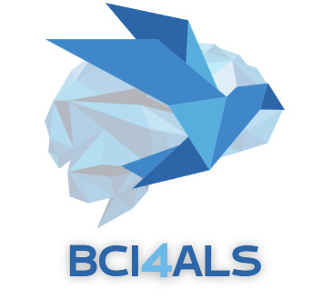
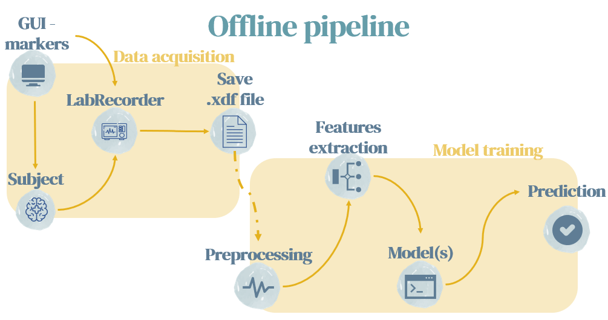
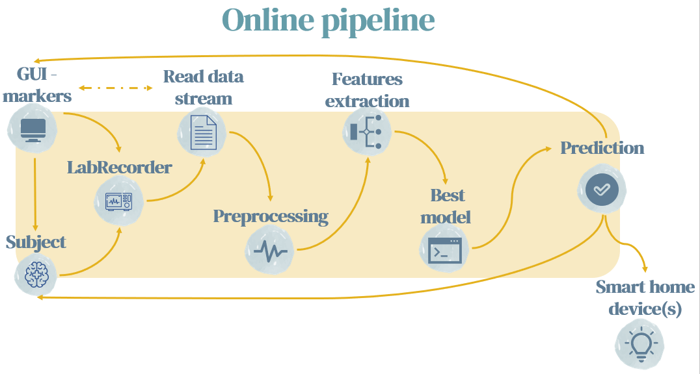

# BCI4ALS | 2022-2023 | TAU
**An EEG data classification based on P300 paradigm, built with python.**

## Table of contents
* [General info](#General-info)
* [Repo structure](#Repo-structure)
* [Setup](#Setups)
* [Notes](#notes)
* [Contacts](#Contacts)

## General info
This project done as part of the BCI4ALS academic course
(for more information regarding the course, please check out: https://www.brainstormil.com/bci-4-als).   
The repository contains both online and offline pipelines that aims to predict the subject's intention regarding different stimuli.  
The end goal of this project is to allow the subject to control smart-Home devises using BCI.

## Repo structure

## Setups
To run this project, first clone the repository:  
`git clone https://github.com/inbarblech/BCI4ALS---Team.git`  
Then install the requirements:   
`cd BCI4ALS---Team`  
`pip install -r requirements.txt`    
In addition, you need to install openBCI-GUI and LabRecorder (lsl).

## Notes
* Current model (EEGNET) results - 
* All the data we used was collected using openBCI based EEG headset with 16 channels.

## Contacts
* Shira Salama - shirasalama@mail.tau.ac.il
* Rinat Saban - rinatsaban@mail.tau.ac.il
* Taly Markovits - 
* Inbar Blech - 